# Step 1 – Register the Azure AD App

Open [https://portal.azure.com/](https://portal.azure.com/) (or [https://entra.microsoft.com/](https://entra.microsoft.com/)).

> For enterprise tenants, sign in with a **Global Administrator** account. Personal Microsoft accounts do not require admin privileges.

After signing in:

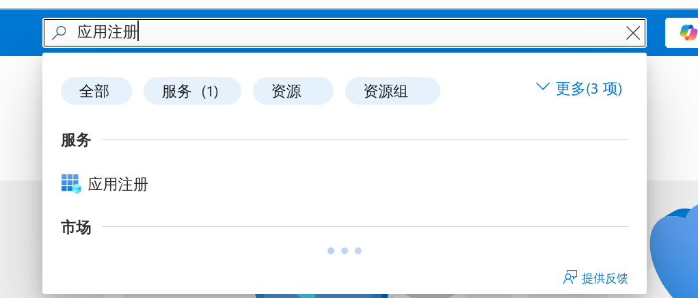

Navigate to **Azure Active Directory → App registrations** and click **New registration**.

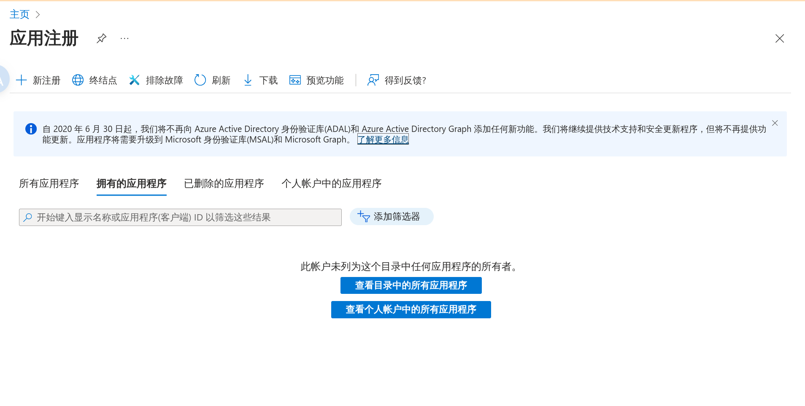


You will see the registration form:

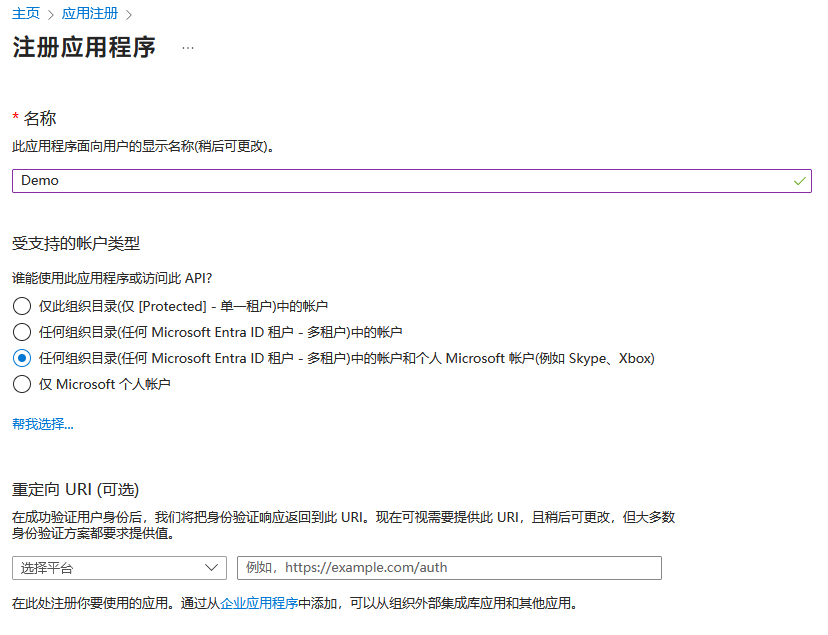

- Pick a **name you can recognize** later.
- Supported account types: choose **Accounts in any organizational directory (Any Microsoft Entra ID tenant – Multitenant) and personal Microsoft accounts (e.g., Skype, Xbox)**.
- Leave the redirect URI blank for now (we will add it shortly).

Click **Register**.


After registration, copy the **Application (client) ID** shown on the overview page and keep it for later.

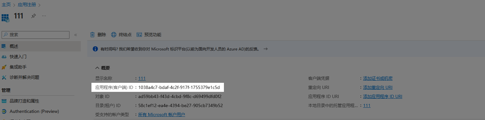

# Step 2 – Add the Redirect URI

## Configure the MSAL Redirect URI

In the left navigation, open **Authentication → Add a platform** and pick **Android**.

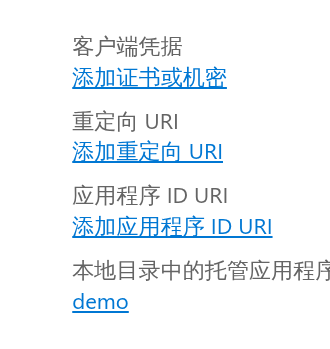
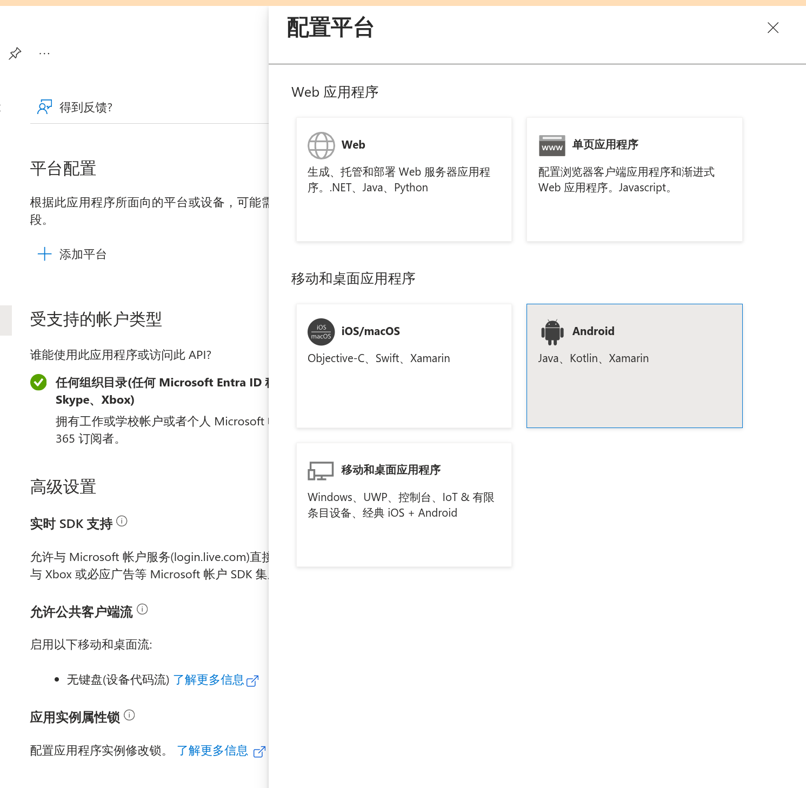

Fill in the following values:

- **Package name**
  ```text
  com.lurenjia534.skydrivex
  ```
- **Signature hash**
  ```text
  rZDXYaNZmghPivXu+4dDWNfayVo=
  ```

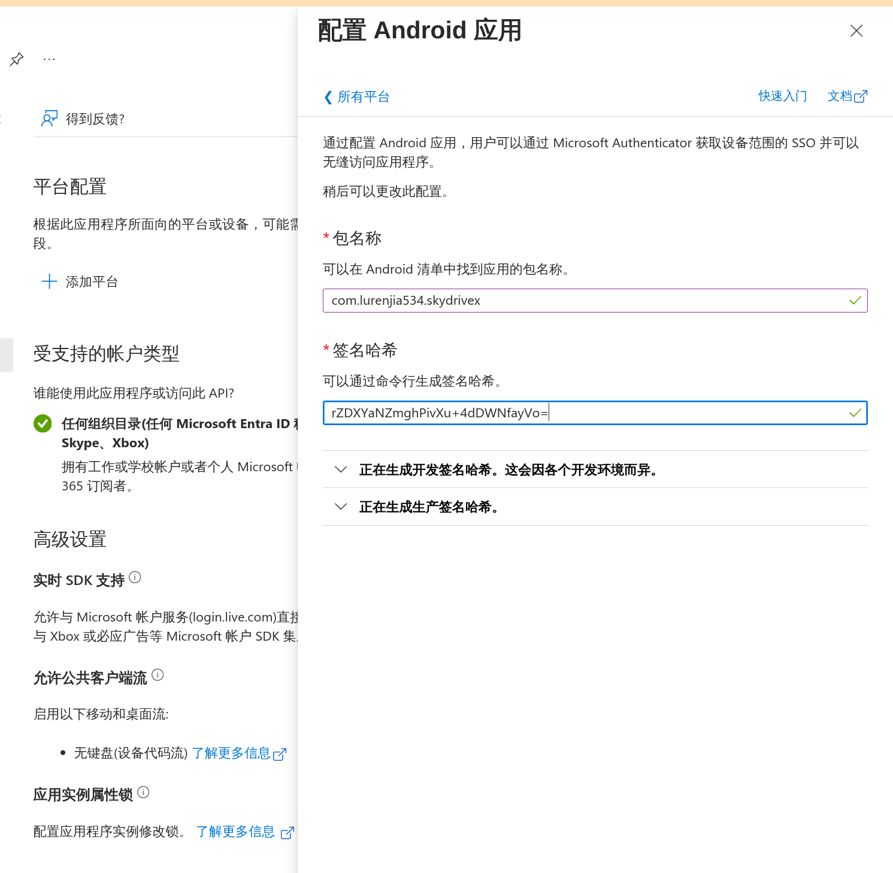

Click **Configure**. When it finishes you should see:

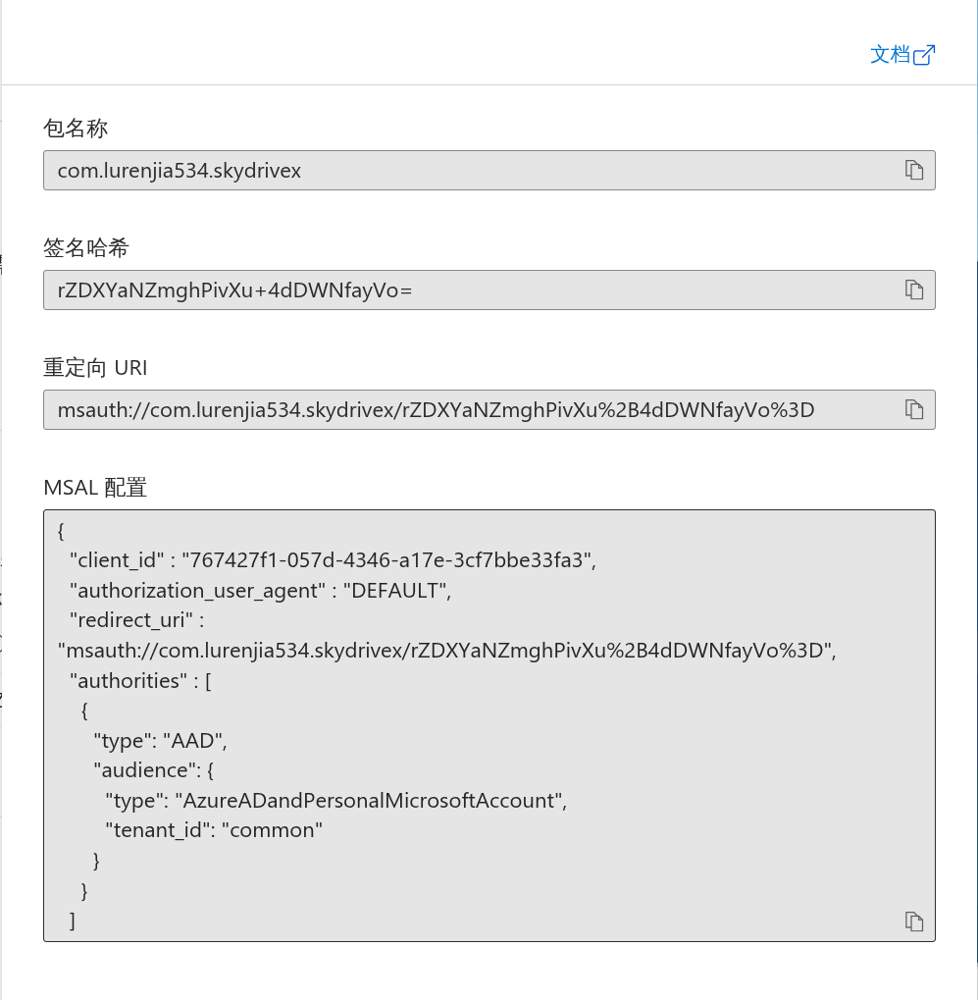

# Step 3 – Grant API Permissions

SkyDrive X requires the delegated permissions `Files.ReadWrite` and `User.Read`. The latter is usually added by default, so only `Files.ReadWrite` needs to be added.

In the app registration page open **API permissions → Add a permission**.

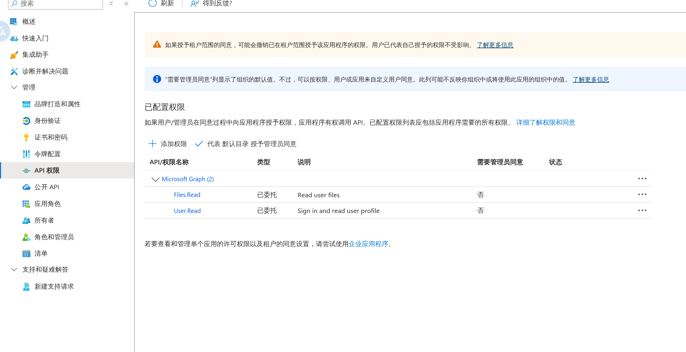

Choose **Microsoft Graph**.

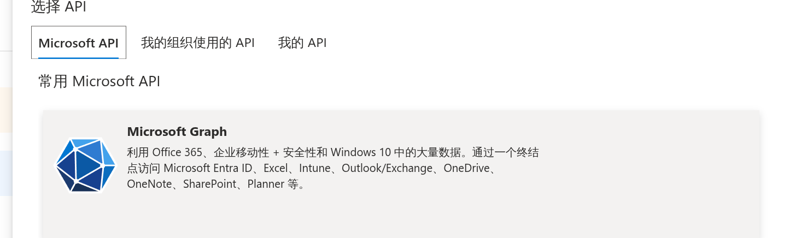

Select **Delegated permissions** (the app accesses the API on behalf of the signed-in user).

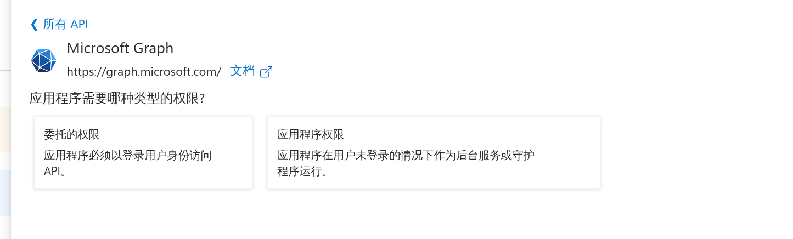

Search for and add `Files.ReadWrite`, then click **Add permissions**.

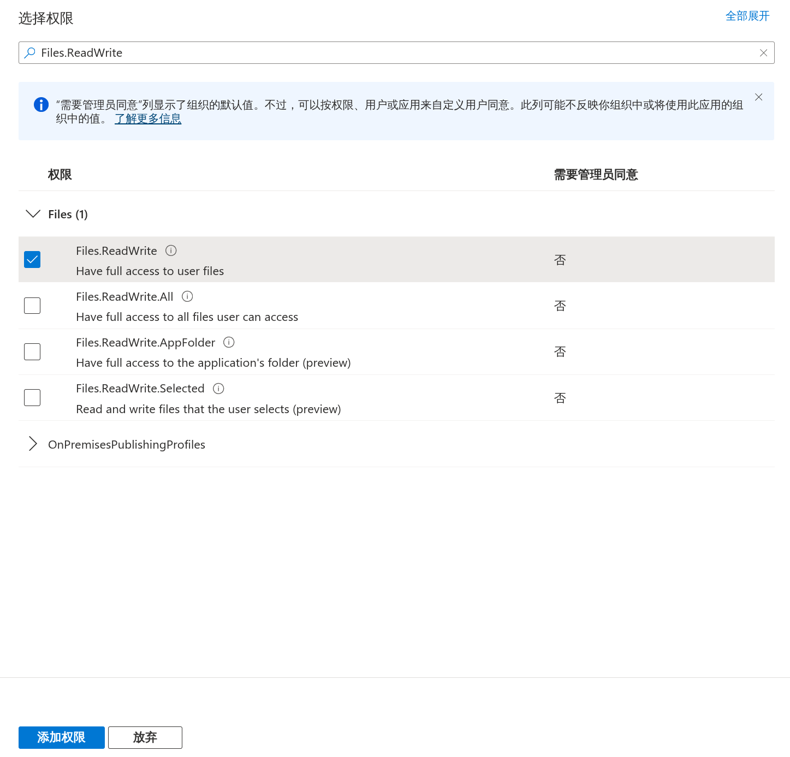

If you are using a work/school tenant, remember to **Grant admin consent** after adding the permission.

# Step 4 – Install & Configure the App

Install SkyDrive X on your device. On first launch the OOBE wizard will prompt for the `client_id`. Paste the value you copied earlier and tap **Save & Sign In**, then complete the MSAL login flow.

You can revisit the wizard later from **Settings → Modify login configuration** if you need to switch to another Azure application.

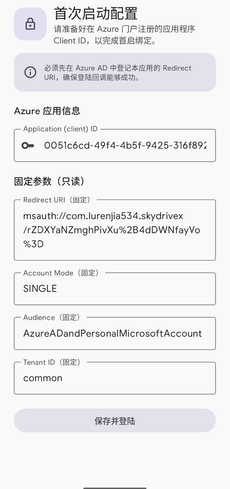
