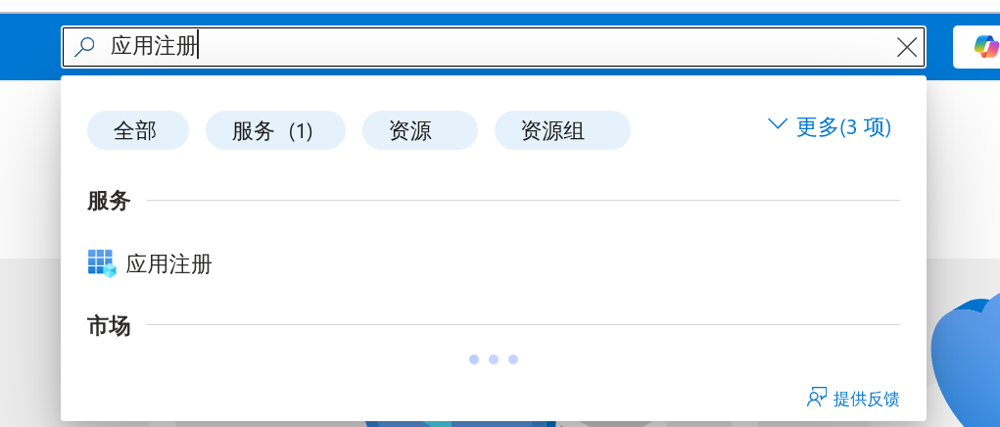
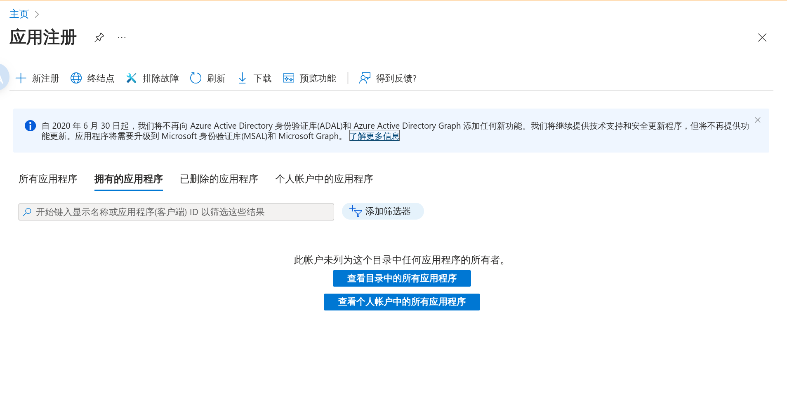
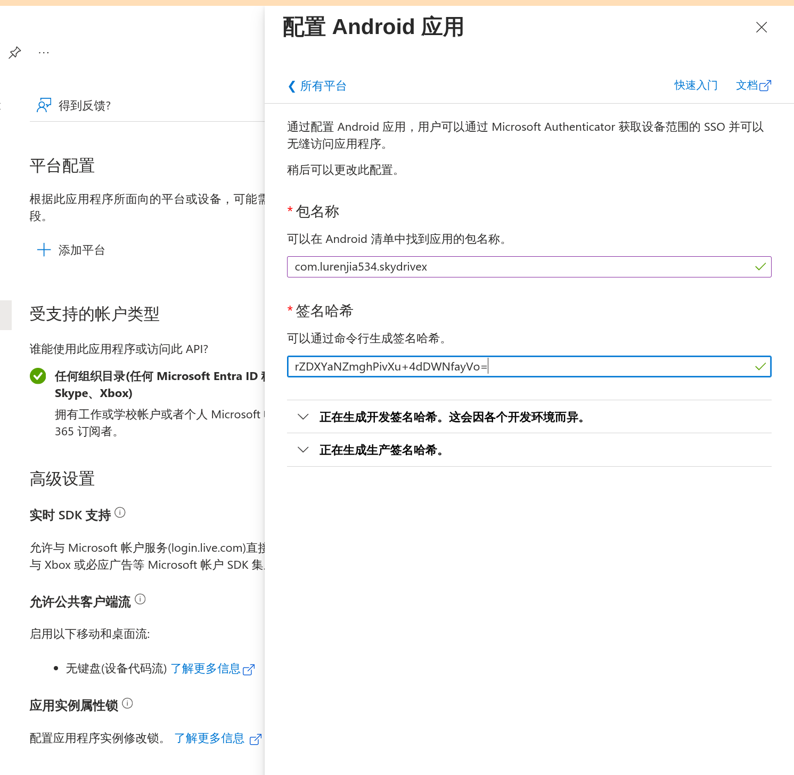
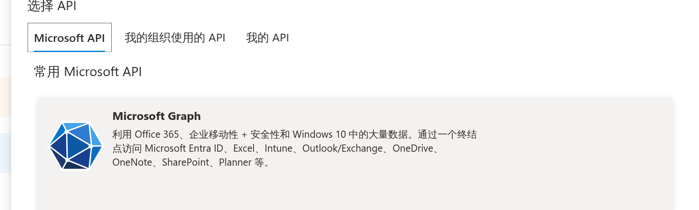
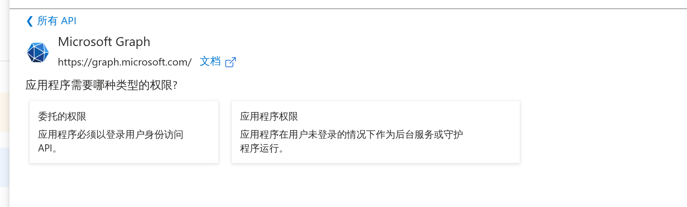
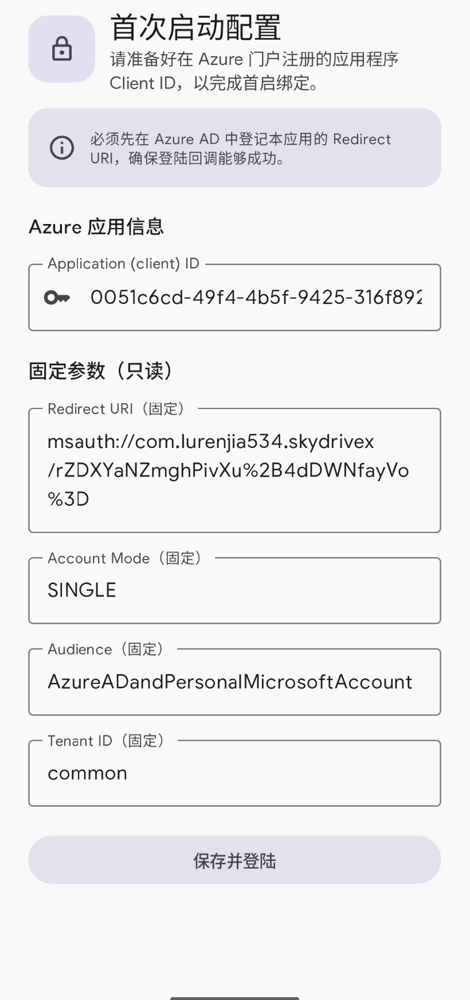

# 第一步 创建AAD APP

打开[https://portal.azure.com/](https://entra.microsoft.com)

如果您是企业租户请尽量使用使用**全局管理员账号**进行操作, 个人版不需要
使用**全局管理员账号**登录后找到



您会能看到如下的界面



点击应用注册


你会看到这样的页面


填写一个**你能记住的名字**

账户类型选择 **任何组织目录(任何 Microsoft Entra ID 租户 - 多租户)中的帐户和个人 Microsoft 帐户(例如 Skype、Xbox).**

重定向 URI 等会填写

点击注册按钮


看到界面上的应用ID


复制这里的**客户端ID并保存**，下一步需要使用

# 第二部添加重定向URL

## 配置MSAL重定向URL

添加重定向URL


身份验证 -> 添加平台 -> Android


看到如下界面



输入 **包名称** 和 **签名哈希**

包名称

```shell
com.lurenjia534.skydrivex
```

签名哈希

```shell
rZDXYaNZmghPivXu+4dDWNfayVo=
```

点击配置,等待完成

然后你会看到如下界面


# 配置权限

应用需要 ```Files.ReadWrite```和```User.Read``` 作为权限, ```User.Read```应当是默认就已经被添加.因此你只需要添加```Files.ReadWrite```


在应用注册找到API权限 -> 添加权限


选择**Microsoft Graph**



选择 **委托的权限 应用程序必须以登录用户身份访问 API。**



搜索并添加权限


点击完成, 即可

# 下载并安装app

在App配置页面把你复制的ID的输入进去点击 **保存并登陆**,登陆账户即可



