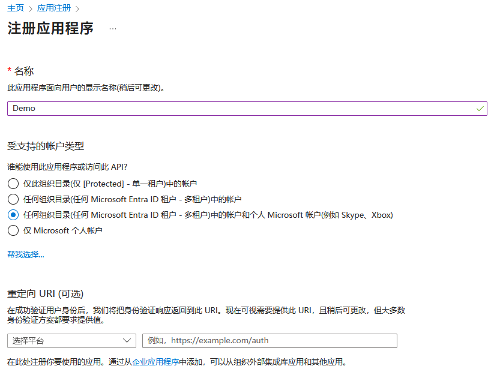
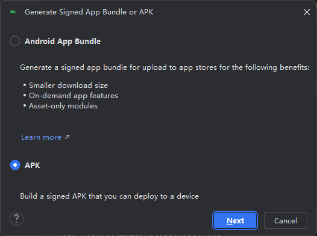
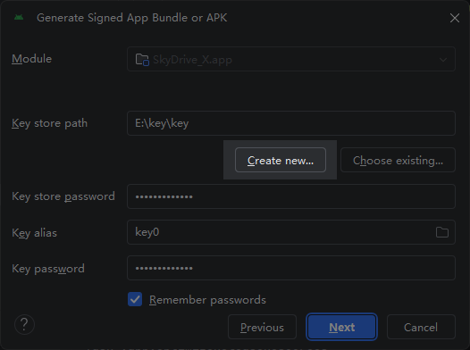
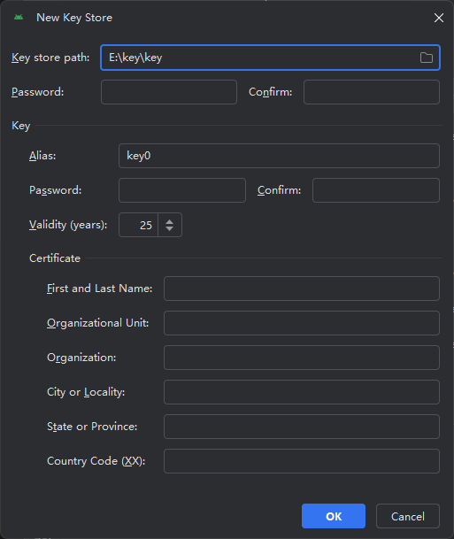
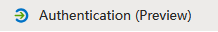
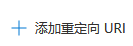
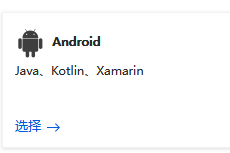
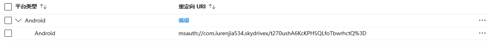

# 第一步 创建AAD APP

打开<a href="https://entra.microsoft.com"><b><span style="color:rgba(16,185,129,1)">entra管理中心</span></b></a>[（微软改名部发力了）.](https://entra.microsoft.com)

使用<b><span style="color:rgba(244,63,94,1)">全局管理员账号</span></b>登录后找到


的


点击


你会看到这样的页面



填写一个<b><span style="color:rgba(16,185,129,1)">你能记住的名字</span></b>

账户类型选择 <b><span style="color:rgba(16,185,129,1)">任何组织目录(任何 Microsoft Entra ID 租户 - 多租户)中的帐户和个人 Microsoft 帐户(例如 Skype、Xbox).</span></b>

重定向URI等会填写

点击


复制这里的<b><span style="color:rgba(16,185,129,1)">客户端ID并保存</span></b>，下一步需要使用

# 第二步 配置项目内相应文件

## 生成KeyStore

打开AS

找到<b><span style="color:rgba(16,185,129,1)">Build</span></b>下的<b><span style="color:rgba(16,185,129,1)">Generate Signed App Bundle or APK...</span></b>



下一步



Create New...



自己选择一个位置存储，填写完密码之后OK创建

## 配置MSAL重定向URL

接下来需要安装Openssl和Android SDK（<b><span style="color:rgba(16,185,129,1)">若已安装则跳过</span></b>）

```shell
keytool -exportcert -alias SIGNATURE_ALIAS -keystore PATH_TO_KEYSTORE | openssl sha1 -binary | openssl base64
不要用系统自带的powershell跑这个命令，有bug！！！！！！！！！！！！！！！！！！！！！！！！
```

然后会生成出来一串签名，复制，<b><span style="color:rgba(16,185,129,1)">保存好</span></b>

回到<a href="#第一步 创建AAD APP"><b><span style="color:rgba(16,185,129,1)">刚才注册应用的浏览器页面</span></b></a>

找到



选择



选择 <b><span style="color:rgba(16,185,129,1)">移动和桌面应用程序</span></b> 下的



填写包名为 <b><span style="color:rgba(16,185,129,1)">com.lurenjia534.skydrivex</span></b>

填写刚才生成的<b><span style="color:rgba(16,185,129,1)">base64 编码 SHA1签名</span></b>


确定你的配置

你会看到这样的页面



复制这个<b><span style="color:rgba(16,185,129,1)">重定向 URI,保存备用</span></b>

## 设置项目内的对应文件

找到 app/src/main/res/raw/auth_config.json

修改<b><span style="color:rgba(16,185,129,1)">client_id</span></b>中的内容为刚才保存的<b><span style="color:rgba(16,185,129,1)">客户端ID</span></b>

修改<b><span style="color:rgba(16,185,129,1)">redirect_uri</span></b>中的内容为刚才保存的<b><span style="color:rgba(16,185,129,1)">重定向 URI</span></b>

找到 app/src/main/AndroidManifest.xml

修改如下片段

```xml
        <activity android:name="com.microsoft.identity.client.BrowserTabActivity"
            android:exported="true">
            <intent-filter>
                <action android:name="android.intent.action.VIEW"/>
                <category android:name="android.intent.category.DEFAULT"/>
                <category android:name="android.intent.category.BROWSABLE"/>
                <data
                    android:scheme="msauth"
                    android:host="com.lurenjia534.skydrivex"
                    android:path="/刚才的签名" />
            </intent-filter>
        </activity>
```

保存<b><span style="color:rgba(16,185,129,1)">所有更改</span></b>

# 第三步 生成APK测试

选择<b><span style="color:rgba(16,185,129,1)">Build</span></b>下的<b><span style="color:rgba(16,185,129,1)">Generate Signed App Bundle or APK...</span></b>

选择刚才的<b><span style="color:rgba(16,185,129,1)">签名文件，输入你设定的密码来使用它</span></b>

选择<b><span style="color:rgba(16,185,129,1)">Release或debug</span></b>，编译完成后安装APK自行登录测试

